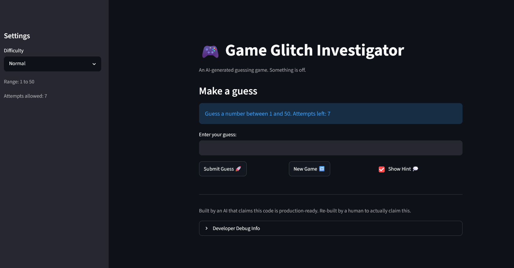

# 🎮 Game Glitch Investigator: The Impossible Guesser

## 🚨 The Situation

You asked an AI to build a simple "Number Guessing Game" using Streamlit.
It wrote the code, ran away, and now the game is unplayable. 

- You can't win.
- The hints lie to you.
- The secret number seems to have commitment issues.

## 🛠️ Setup

1. Install dependencies: `pip install -r requirements.txt`
2. Run the broken app: `python -m streamlit run app.py`

## 🕵️‍♂️ Your Mission

1. **Play the game.** Open the "Developer Debug Info" tab in the app to see the secret number. Try to win.
2. **Find the State Bug.** Why does the secret number change every time you click "Submit"? Ask ChatGPT: *"How do I keep a variable from resetting in Streamlit when I click a button?"*
3. **Fix the Logic.** The hints ("Higher/Lower") are wrong. Fix them.
4. **Refactor & Test.** - Move the logic into `logic_utils.py`.
   - Run `pytest` in your terminal.
   - Keep fixing until all tests pass!

## 📝 Document Your Experience

- The game's purpose is to have users guess a number within a certain threshold. There's three difficulty levels to choose from, the opportunity to enable hints while playing, and to play again regardless of a win or a loss.
- Several bugs were found, mainly UI inconsistencies between the sidebar and the main game screen, as well as reversed logic and hints when it came to counting attempts. Guesses were also parsed incorrectly.
- In addition to the bugs mentioned above, we also moved some UI elements around for better presentation and gameplay, as well as adjusted the difficulties to ensure that "Easy" felt easy, "Hard" felt hard, etc. Pytests were implemented to ensure functionality and refactoring remained consistent and correct during bug fixes.

## 📸 Demo Walkthrough

Describe your fixed game in numbered steps so a reader can follow along without watching a video:

1. Change the difficulty to whatever you wish via the sidebar (use "Easy" for quick testing.)
2. Enter a guess of 10.
3. If hints were enabled, you should be directed to go higher or lower.
4. Game ends after the correct guess with the opportunity to play a new game.
5. Or, if you lost, you are then told the correct answer and given the opportunity to play a new game.
6. For debugging, scroll to the bottom to show the Developer Debug Log (the answer is not shown there).

**Screenshot** *(optional)*:




## 🧪 Test Results

```
==================== test session starts =====================
platform win32 -- Python 3.13.14, pytest-9.1.0, pluggy-1.6.0 -- C:\Users\dawnm\AppData\Local\Programs\Python\Python313\python.exe
cachedir: .pytest_cache
rootdir: C:\Local Drive\codepath\AI110\week2\ai110-module1show-gameglitchinvestigator-starter
plugins: anyio-4.13.0
collected 22 items                                            

tests/test_game_logic.py::test_winning_guess PASSED     [  4%]
tests/test_game_logic.py::test_guess_too_high PASSED    [  9%]
tests/test_game_logic.py::test_guess_too_low PASSED     [ 13%]
tests/test_game_logic.py::test_easy_range PASSED        [ 18%]
tests/test_game_logic.py::test_normal_range PASSED      [ 22%]
tests/test_game_logic.py::test_hard_range PASSED        [ 27%]
tests/test_game_logic.py::test_parse_guess_valid PASSED [ 31%]
tests/test_game_logic.py::test_parse_guess_non_integer PASSED [ 36%]
tests/test_game_logic.py::test_parse_guess_decimal PASSED [ 40%]
tests/test_game_logic.py::test_parse_guess_out_of_range PASSED [ 45%]
tests/test_game_logic.py::test_parse_guess_empty PASSED [ 50%]
tests/test_game_logic.py::test_parse_guess_negative PASSED [ 54%]
tests/test_game_logic.py::test_parse_guess_large_number PASSED [ 59%]
tests/test_game_logic.py::test_update_score_win PASSED  [ 63%]
tests/test_game_logic.py::test_update_score_too_high_normal PASSED [ 68%]
tests/test_game_logic.py::test_update_score_too_low_normal PASSED [ 72%]
tests/test_game_logic.py::test_update_score_win_late_attempt PASSED [ 77%]
tests/test_game_logic.py::test_update_score_too_high_easy PASSED [ 81%]
tests/test_game_logic.py::test_update_score_too_high_hard PASSED [ 86%]
tests/test_game_logic.py::test_update_score_too_low_hard PASSED [ 90%]
tests/test_game_logic.py::test_update_score_no_negative PASSED [ 95%]
tests/test_game_logic.py::test_update_score_no_change_on_invalid_outcome PASSED [100%]

===================== 22 passed in 0.05s =====================

```

## 🚀 Stretch Features

- [ ] [If you choose to complete Challenge 4, describe the Enhanced UI changes here — a screenshot is optional]
